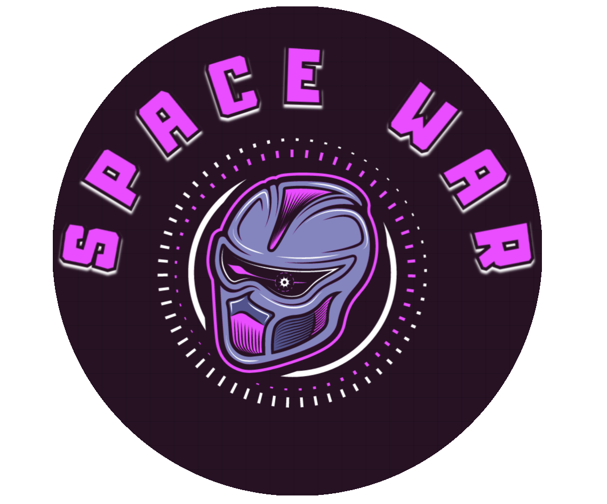
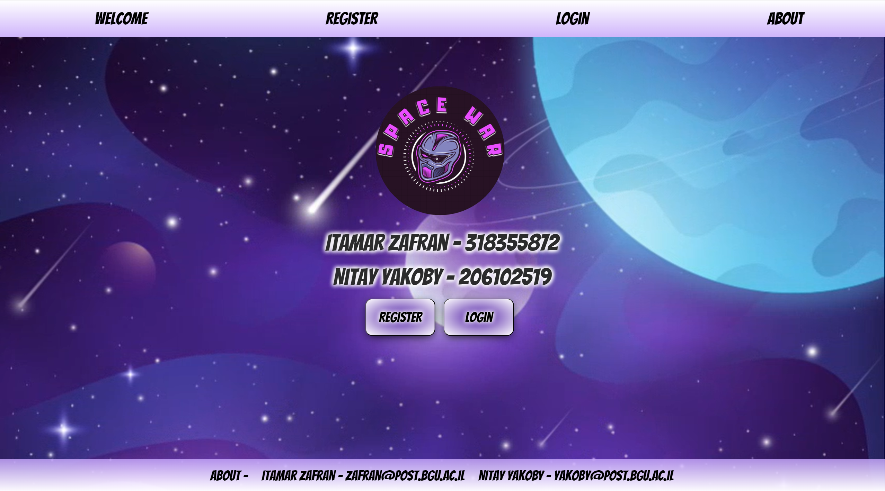
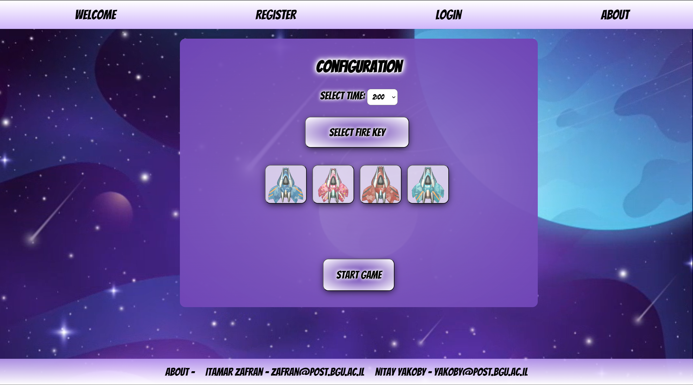
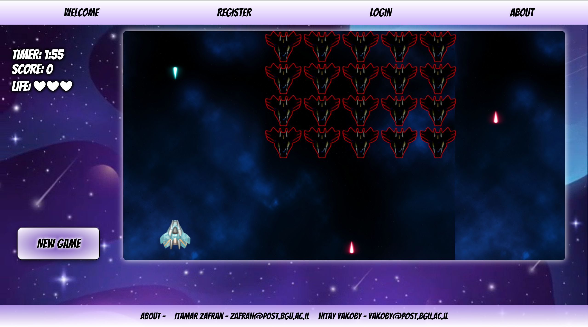
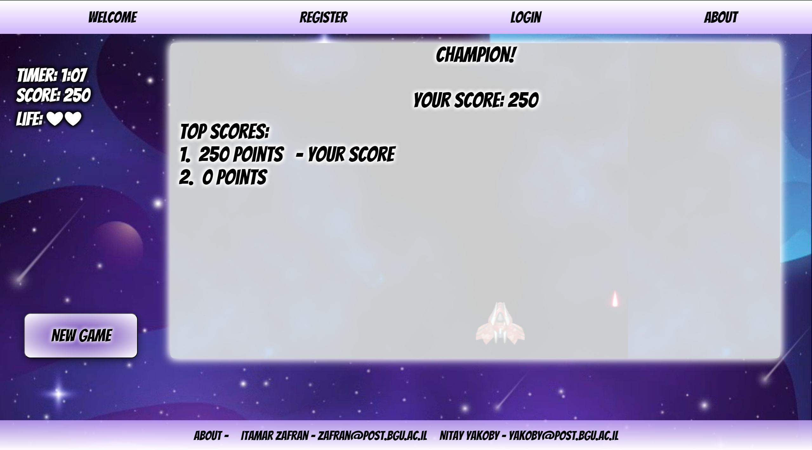

  

## Website

[Space War](https://web-development-environments-2023.github.io/assignment2-318355872_206102519/)

## Abstract
Welcome to the README file for our Space War game!
 This document includes crucial details to help you better understand how to play the game and maximize your experience.
 Additionally, we'll provide an overview of the key files in the project.

<b>Founders:</b>
<u>Itamar Zafran</u> - 318355812, <u>Nitay yakoby</u> - 206102519

## Installation

1. Clone the repository.
2. Open file called "index.html" with your browser
3. register/login and start game

## Files
<b>1.</b>"index.html" - This file contains the content of our website. 
<b>2.</b>"change-content.js" - This JavaScript file manages the changing content of the HTML page as we navigate through the website. 
<b>3.</b>"configuration.js" - This JavaScript file is responsible for the functionality of the configuration screen. 
<b>4.</b>"login.js" - This JavaScript file manages the functionality that occurs during a login session. 
<b>5.</b>"register.js" - This JavaScript file manages the functionality that occurs during a registration session. 
<b>6.</b>"game.js" - This JavaScript file manages all the functionality of the game and connects to the "canvas" tag in the HTML file. 

## Game Screen Shots

  # WelcomePage  
  

  # ConfigurationPage
  

  # GamePage
  

  # ScorePage
  
